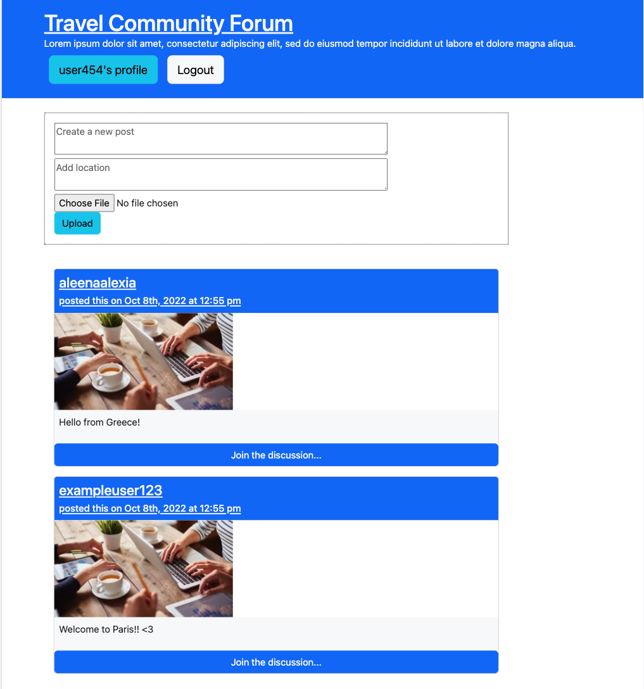

# Travel Community Forum

Many popular social media platforms are broad they can get you lost in the mix of all the different posts available. Our Travel Community Forum, creates a niche social media platform that is more personal and meaningful to avid travelers.

The Travel Community Forum allows travels to share their favorite vacation photos from all around the globe. With our app, people can connect and meet others who share their interests in traveling. 

## Table of Contents
* [Installation Instructions](#installation-instructions)
* [Github Repo](#github-repo)
* [Authors](#authors)

## Installation

Clone GitHub repository to local device and seed data with `npm run seed`

```bash
  npm run install
  npm run develop
```
    
## Github Repo

https://github.com/sandraxmm/TravelCommunityPlatform

## Authors

- [@aleenaalexia](https://github.com/aleenaalexia)
- [@sandraxmm](https://github.com/sandraxmm)
- [@javiFmorales](https://github.com/javiFmorales)
- [@jennyferconstanza](https://github.com/jennyferconstanza)


## Screenshots


